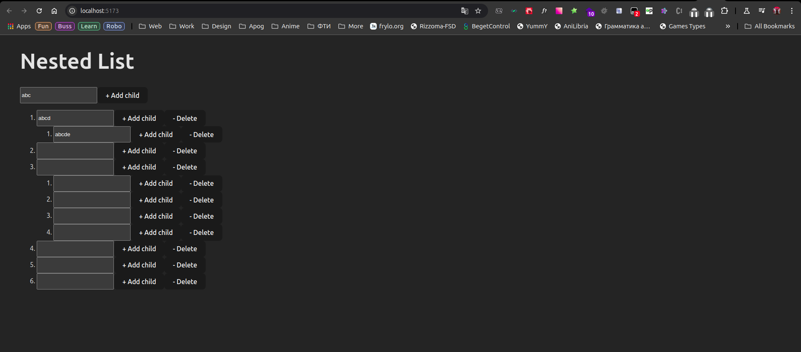

# Test Task Kinescope

The task was to develop nested list with buttons, that allow to manage it ([full task](https://gist.github.com/kinescoper/8469095b180a54fcd0b459ff571a8b51)).

## How to start project

```
nvm use
pnpm install
pnpm dev
```

## Preview



## Reached goals

1. Using HOC to split logic from UI, make component reusable and prepare for possible future usage of state-management lib.
2. Demonstrated knowledge of styled-components.attrs at [styles file](./src/components/NestedList/NestedList.styles.ts).
3. Root of list cannot be deleted.
